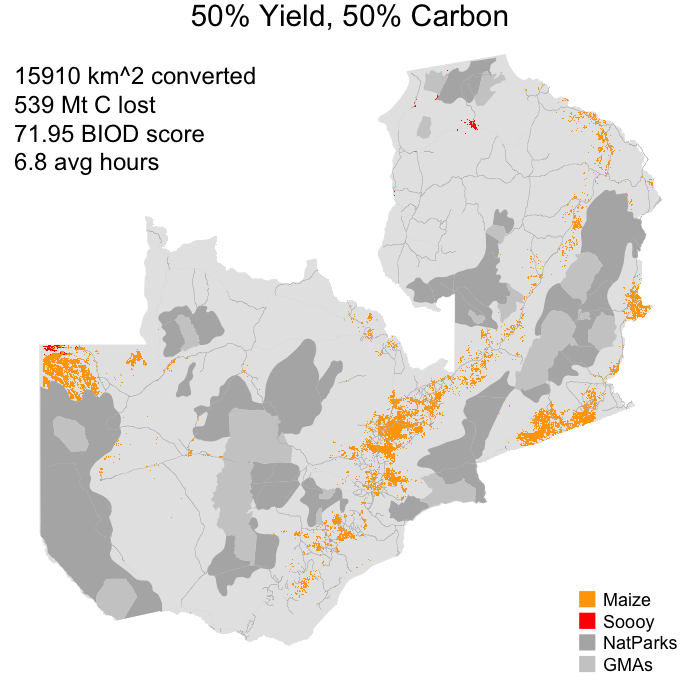

# Overview

A brief example of how to run the model, using data for Zambia.   

# Set parameters

Set up your R script in the Rmd output folder. Take the following two lines of code, and execute them. The vector `prod_targ` contains multiplier values for how much production levels for maize and soybean will increase relative to current production levels. Below that, give the values of the weights you want to apply to each of four land use priorities, in the `cbeta` vector. The priorities are: 

1. To find the land that is highest yielding for each crop (Y);
2. To minimize the amount of carbon lost when creating new farmland (C); 
3. To minimize the amount of biodiversity loss (BD); 
4. To minimize the costs of production, here measured in terms of travel time (COST); 
```{r}
prod_targ <- c("maize" = 4, "soy" = 2)  # production target list
cbetas <- c("Y" = 0.5, "C" = 0.5, "BD" = 0.0, "COST" = 0.0)  # Weights vector
```

# Run the model

The execute the code below, which uses the weights above to find the land that is needed to satisfy the production targets. The output map, displayed here, can be found in the `demo.png` file in the Rmd folder. 

```{r, eval = FALSE}
```{r}
library(agroEcoTradeoff)

# Run model
toff <- tradeoff_mod(prod_targ, ybetas = list(1, 1), cbetas = cbetas, 
                     currprodmod = 1, input_key = "ZA", ybeta_update = 0,
                     exist_list = NULL, silent = TRUE)
convr <- calc(dt_to_raster(toff$conv, CRS(toff$inputs$sp$crs)) * c(1, 2), sum) 
imp_plot(dtr = convr, impacts = toff$impacts, fpath = ".", fnm = "demo", 
         ftitle = "50% Yield, 50% Carbon", crops = c("Maize","Soy"), 
         stats = TRUE, # cols = vector of map colors to use
         input_key = "ZA", legend = TRUE)
```
Note:
`tradeoff_mod()` creates `toff`, which then has three parts: `conv`, `impacts`, and `inputs`.
`calc()` applies a function, in this case, sum, to the raster toff$conv. You also need to set the CRS.



